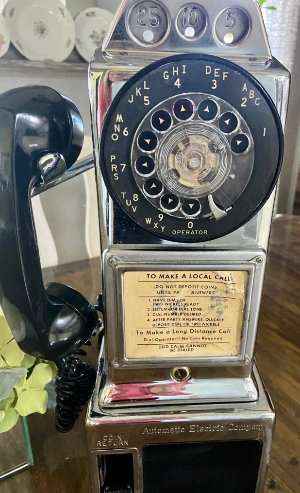

# pay-phone

Bringing a vintage **Automatic Electric 3-slot rotary payphone** back to life to make real calls
over **Wi-Fi + Google Voice** — **no landline, no cell/SIM line, and no monthly bills**. The
authentic rotary dial works and the original bell physically rings on incoming calls.

## Docs
- **[PLAN.md](./docs/PLAN.md)** — full implementation plan (Option A, $0/month) with two build variants:
  - **Version 1 — Smartphone brain** (spare Android + official Google Voice app; recommended).
  - **Version 2 — Raspberry Pi brain** (fully scriptable; unofficial GV bridge).
- **[TASKS.md](./docs/TASKS.md)** — checklist task tracker with dependencies and a decision log.
- **[HARDWARE.md](./docs/HARDWARE.md)** — Version 2 (Raspberry Pi) bill of materials / shopping list.
- **[PI-SETUP.md](./docs/PI-SETUP.md)** — headless Pi 3B setup runbook → first Google Voice call.
- **[WIRING.md](./docs/WIRING.md)** — reverse-engineering the payphone internals + handset-audio wiring.
- **[SHOPPING-LIST.md](./docs/SHOPPING-LIST.md)** — buyable BOM with part numbers, prices, and links.

## The idea in one line
Google Voice won't give out SIP credentials, so instead of paying for a SIP line, a device that
already runs Google Voice becomes the phone's "brain"; the ESP32 + wiring handle the rotary dial,
hook switch, handset audio, and the ~90V bell.

> ⚠️ **Safety:** the bell ring circuit runs at ~90V AC — treat it as a shock hazard and keep the
> microcontroller logic isolated from it.
