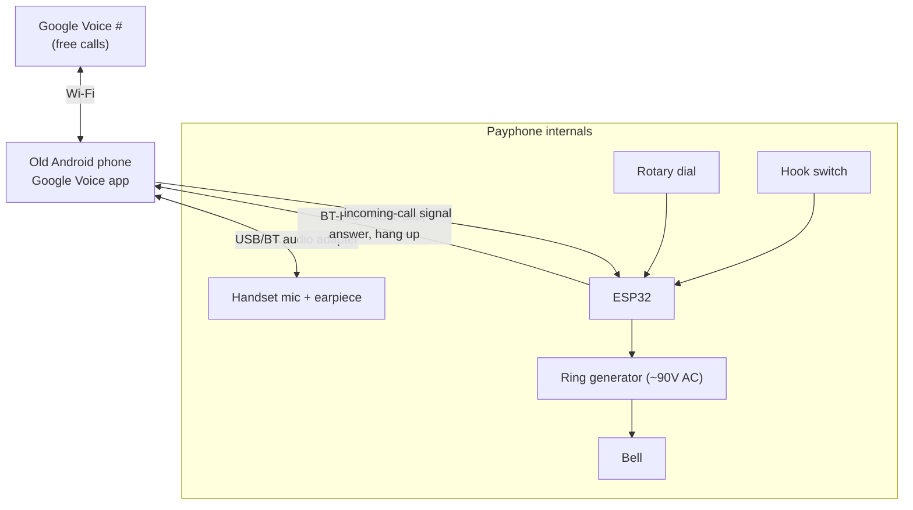
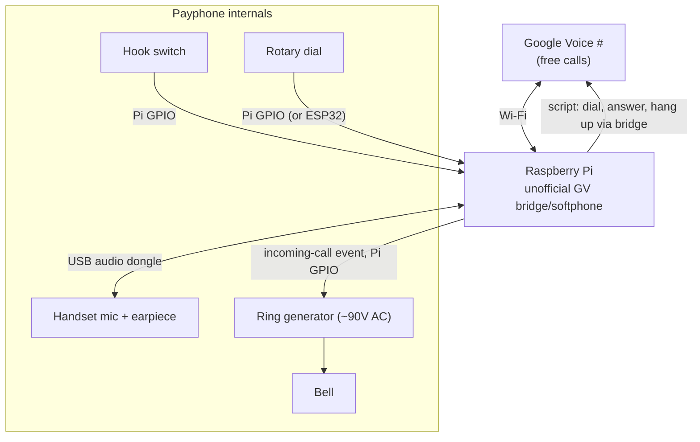

# Bringing an Automatic Electric 3-Slot Rotary Payphone Back to Life — $0/Month (Option A)

## Goal
Make **real outbound and inbound phone calls** on a vintage Automatic Electric Company
three-slot rotary payphone, with **no landline, no dedicated cell/SIM line, and no recurring
monthly bill**. The authentic **rotary dial must work** and the original **bell must physically
ring** on incoming calls.

### Hard requirements (from user)
- **No landline, no cell/SIM line.** Calling rides on **Wi-Fi + Google Voice**.
- **Wi-Fi only** at the phone's location.
- **No monthly bills.** Google Voice is free (free US number, free US/Canada calls/texts).
- **Rotary dial must work authentically** — dialing on the real dial places the call.
- **Bell must physically ring** on incoming calls.
- **Real dial tone** heard in the handset.
- Comfortable with **microcontroller + soldering**; **budget for parts is not the constraint.**

---

## Current status (updated 2026-07-26)

| Milestone | State |
|-----------|-------|
| Build version chosen (**D1 = V2, Raspberry Pi**) | ✅ done |
| Google Voice number | ✅ done |
| Pi online headless (flash → SSH → VNC → update) | ✅ done |
| **Real Google Voice call placed from the Pi** | ✅ **validated** (needs a USB mic — Pi 3B has none) |
| Alternatives evaluated & rejected (**D7** Cell2Jack, **D8** UniFi Talk/ATA) | ✅ done — see [TCO.md](./TCO.md) |
| Rotary pulse decoder + 23 unit tests | ✅ done — see [SOFTWARE.md](./SOFTWARE.md) |
| GV call control CLI (`gvcall.py`) | 🔄 written; **selectors need verifying on the real DOM** |
| Payphone teardown & tracing (`reverse-wiring`) | 🔄 ready to start — worksheet below |
| Hardware purchases | ⏸️ deliberately deferred until the software risk is retired |

**Next two actions, neither requiring a purchase:**
1. Run `python3 tools/gvcall.py probe` on the Pi and fix `src/payphone/gv_selectors.py`. This
   retires the project's biggest remaining unknown — whether GV calling can be *scripted*, not
   just clicked.
2. Trace the payphone with a multimeter, recording results in
   **[WIRING-WORKSHEET.md](./WIRING-WORKSHEET.md)**. Use `tools/gpio_probe.py` to identify the dial
   and hook contacts — the Pi reads 10pps pulses far more reliably than a multimeter can.

---

## Why Option A (and how it stays free)
Google Voice never hands out SIP credentials, so a normal VoIP adapter (ATA) can't log into it.
Paying for a SIP DID would fix that but adds a monthly bill. **Option A avoids SIP entirely: a
device that already runs Google Voice becomes the "brain" of the payphone.** All calling happens
through Google Voice for **$0/month**; our job is the physical glue — handset audio, hook switch,
rotary dial, and the bell.

This document has **two build variants** of Option A:
- **Version 1 — Smartphone brain** (runs the official Google Voice app). *Recommended.*
- **Version 2 — Raspberry Pi brain** (runs an unofficial Google Voice bridge/softphone).

Pick one. Version 1 is more reliable (official app); Version 2 is more scriptable/self-contained.

> ✅ **Decision D1 — chosen: Version 2 (Raspberry Pi brain).** The owner accepts the unofficial
> GV-bridge maintenance risk in exchange for tidier internal wiring, with all electronics fully
> concealed inside the shell (authentic landline look/behavior). See **[HARDWARE.md](./HARDWARE.md)**
> for the Version 2 bill of materials, and **[PI-SETUP.md](./PI-SETUP.md)** for the headless Pi
> setup runbook (flash → SSH → VNC → audio → GV bridge → test call).

### Considered and rejected: analog Bluetooth gateways (Cell2Jack, XLink BT)
A tempting shortcut is a **cell-to-landline Bluetooth gateway** such as **Cell2Jack** (~$40) or
**XLink BT HD**. These pair to a phone over Bluetooth **Hands-Free Profile (HFP)** and present a
standard RJ11 jack with dial tone and ring voltage — seemingly solving all four jobs at once, with
no soldering and no DIY 90V circuit.

**Why it doesn't work here — the dial path breaks.** HFP dialing sends an `ATD<number>;` command to
the paired phone, which Android routes to its **native carrier dialer, not to the Google Voice app**.
Google states plainly: *"To use Wi-Fi for a call, start the call from the Voice app."* On a SIM-less
phone there is no carrier, so **lifting the handset and dialing simply fails**. Cell2Jack's own
support pages concede that with third-party VoIP apps *"audio is ok but other function may not
work,"* and that you *"may need to … dial from your cellphone and then pickup home phone to talk"* —
useless for a payphone that must dial from its own rotary dial. Its "Hangout Helper" workaround
targets Google Hangouts, **discontinued in 2022**.

Three further unknowns, none of them resolved by the vendor's docs:
- **Pulse decoding is not actually documented.** Marketing says "rotary," but the official setup page
  tells users with a pulse/tone switch to *"select tone dialing"* — implying DTMF, not 10-pps decode.
- **Ring power is unspecified.** No published voltage, waveform, or REN limit. It has a "strong ring"
  mode (`21#`) and vendor guidance about adjusting the **bias spring** or adding an external ringer
  amplifier — a payphone's heavy gong is a worst-case load.
- **`ATD` routing can't be fixed by swapping gateways.** XLink BT HD documents pulse dialing and
  stronger ringing, but it's still an HFP bridge with the same Android problem.

> ⚠️ **Partial workaround exists but is not dependable.** [SouthJack](https://github.com/aarongress1/southjack)
> is a root-free Android app that cancels the HFP-initiated carrier call and relaunches it into
> Google Voice via `ACTION_CALL`. The approach is technically sound, but as of this writing it is a
> **~2-week-old proof of concept: one commit, no release APK, zero stars/forks/issues, tested on a
> single Samsung device**, and it requires disabling the phone's secure lock screen. It also cannot
> help with pulse decoding — it only receives a number Android already parsed.

**Verdict:** not a viable primary path for a $0/month SIM-less Google Voice build. It also would
require reverting **D1** to V1 (Android brain), abandoning the Pi + Chromium path already validated
with a real call. See **decision D7**.

---

## Shared concepts (apply to both versions)

### The four jobs the "brain" must do
1. **Audio** — carry the handset microphone and earpiece to/from the brain's call audio.
2. **Off-hook / on-hook** — the **hook switch** starts a call (lift = go off-hook) and ends it
   (hang up = on-hook).
3. **Dialing** — the authentic **rotary dial** pulse train becomes the phone number to call.
4. **Ring** — an **incoming Google Voice call** must fire the original **bell** (~90V AC / 20Hz,
   generated locally — treat as a shock hazard).

### Payphone teardown & rewiring (both versions)
> 🔧 See **[WIRING.md](./WIRING.md)** for the step-by-step teardown/tracing procedure, the
> internals→Pi signal map, and the handset-audio wiring — all with Mermaid diagrams.
- The Automatic Electric 3-slot phone is wired for a coin/relay + operator system, not a plain
  circuit. Reverse-engineer the internal wiring and expose four things as clean signals:
  - **Handset** transmitter (carbon mic; may swap for an electret + bias network for clean audio)
    and receiver.
  - **Hook switch** contacts (on-hook vs off-hook).
  - **Rotary dial** pulse (interrupt) contacts + off-normal/shunt contacts.
  - **Ringer coil + series capacitor** for the bell.
- **Bypass the coin mechanism** — not needed for calling (optionally re-enable later as an
  "insert coin for dial tone" gate).

### Rotary dial handling (both versions)
- An **ESP32/Arduino** counts pulses per digit (1–10 pulses, 10 = "0"), detecting end-of-digit by
  the inter-digit pause.
- **Opto-isolate** the pulse sensing so no telephone-line voltage reaches the microcontroller GPIO.
- The digits become a phone number the brain dials (mechanism differs per version — see below).

### Bell / ring (both versions)
- Drive the original ringer with a small **ring-voltage generator** (e.g., a boost/H-bridge ring
  module producing ~90V AC 20Hz, or a salvaged ring generator), switched by the ESP32 when the
  brain signals an incoming call.
- Tune the ringer capacitor so the bell strikes reliably.

### Safety (both versions)
- **~90V AC ring voltage is a shock hazard** — don't probe it live; isolate logic from it.
- Never power the ESP32 from any high-voltage rail.

---

## Version 1 — Smartphone brain (recommended, most reliable)

### Architecture

### Why a smartphone
- Runs the **official Google Voice app** → calling is reliable and $0/month.
- Has **mic, speaker, Wi-Fi, and battery** built in — a complete phone already.
- Main effort is *automating the app* and wiring the physical controls.

### Hardware (Version 1)
- **Spare Android phone** (any that runs the Google Voice app; kept on Wi-Fi, always-on charger).
- **USB or Bluetooth audio adapter** to route the payphone handset mic/earpiece to the phone.
- **ESP32** (Bluetooth-capable) to read dial + hook and to *inject dialing/answer actions*.
- **Ring generator module** (~90V AC 20Hz) + driver transistor/relay for the bell.
- Bench/telephony tools: multimeter, soldering kit, spare handset cord, wire, heat-shrink, opto-couplers.

### How each job is solved (Version 1)
- **Dialing:** ESP32 buffers the rotary-dialed number, then "types" it into the Google Voice app.
  Two mechanisms:
  - **Bluetooth HID keyboard emulation** — ESP32 pairs as a keyboard and sends the digits + a
    dial action into the app's dialer field. (Cleanest; no root.)
  - **ADB over USB/Wi-Fi** — a small script issues `input text <number>` and taps "call".
- **Answer / hang up:** hook switch → ESP32 → sends the app's answer/end action (BT key or ADB tap).
- **Incoming ring:** detect the incoming call on the phone (an automation app like MacroDroid/
  Tasker, or ADB polling of call state) → signal the ESP32 → ESP32 fires the ring generator → bell.
- **Audio:** handset mic/earpiece ↔ USB/BT audio adapter ↔ phone.

### Version 1 tradeoffs
- ➕ Official GV app = highest reliability, simplest calling, truly $0/month.
- ➖ Automating a phone UI is a little hacky (BT-HID or ADB); app updates may shift UI elements.

---

## Version 2 — Raspberry Pi brain (fully scriptable, unofficial GV)

### Architecture

### Why a Raspberry Pi
- A full Linux computer → **everything is scriptable**: GPIO reads the dial/hook directly, a USB
  audio dongle handles the handset, and software places/answers calls with no "faking screen taps."
- **No official Google Voice app for Linux**, so GV must go through an **unofficial bridge/softphone**
  (self-hosted connector, or Asterisk + a GV connector). This is the fragility tradeoff.

### Hardware (Version 2)
- **Raspberry Pi** (Pi 4 / Pi 5 / Zero 2 W) + power + microSD, on Wi-Fi.
- **USB audio dongle** (mic + speaker) to interface the payphone handset.
- **ESP32 optional** — the Pi's GPIO can read the rotary dial/hook directly, but an ESP32 can offload
  precise pulse timing if desired.
- **Ring generator module** (~90V AC 20Hz) + driver, switched from a Pi GPIO.
- Same bench/telephony tools and opto-couplers as Version 1.

### How each job is solved (Version 2)
- **Google Voice access:** run an **unofficial GV bridge/softphone** on the Pi (self-hosted
  connector, or Asterisk + a Google Voice connector) — no monthly fee, but unofficial and may
  break when Google changes things.
- **Dialing:** Pi GPIO (or an ESP32 feeding the Pi) counts rotary pulses → assembles the number →
  a script places the call through the GV bridge.
- **Answer / hang up:** hook switch on a GPIO → software off-hook/on-hook to start/answer/end calls.
- **Incoming ring:** the bridge raises an incoming-call event → Pi GPIO fires the ring generator → bell.
- **Audio:** handset mic/earpiece ↔ USB audio dongle ↔ Pi ↔ bridge.

### Version 2 tradeoffs
- ➕ Fully self-contained and scriptable; clean GPIO wiring; no UI automation hacks.
- ➖ Google Voice access is **unofficial** and can break; more software to build and maintain.

---

## Validation strategy (both versions — test bottom-up)
1. **Brain calls out/in on its own** (phone app, or Pi bridge) over Wi-Fi with a headset — confirm
   Google Voice inbound + outbound works before touching the payphone.
2. **Payphone teardown documented**; tip/ring, hook, dial, ringer identified; coin mech bypassed.
3. **Handset audio** routed through the adapter/dongle — clean two-way audio.
4. **Hook switch** starts/answers/ends calls correctly.
5. **Rotary dial** → correct number captured and dialed (test every digit incl. "0").
6. **Bell** physically rings on an incoming GV call; tune ring generator + capacitor.
7. **End-to-end:** rotary-dial an outbound call that connects; receive a GV call that rings the bell
   and is answered with the handset.

---

## Open decisions / risks
- **D1 — Which version:** ✅ **Chosen: V2 Raspberry Pi** (scriptable; accepts unofficial GV bridge risk).
- **D2 — Dial automation (V1):** Bluetooth-HID keyboard emulation vs. ADB scripting.
- **D3 — GV bridge choice (V2):** self-hosted connector vs. Asterisk + GV connector.
- **D4 — Ring generator:** off-the-shelf ~90V AC ring module vs. salvaged ring generator.
- **D5 — Handset transmitter:** keep original carbon mic vs. swap for electret + bias network.
- **D6 — Dial reader:** ESP32 vs. (V2) direct Raspberry Pi GPIO.
- **D7 — Analog Bluetooth gateway (Cell2Jack/XLink):** ❌ **Rejected as primary.** HFP `ATD` dialing
  routes to the native carrier dialer, not Google Voice, so outbound dialing fails on a SIM-less
  phone; pulse decoding and ring power are both undocumented. Optional cheap experiment only.
- **D8 — ATA-based FXS line (UniFi Talk / OBi / SIP):** ❌ **UniFi rejected — staying on the Pi.**
  The UT-ATA ($99) is locked to the Talk app (not a standalone SIP ATA), Talk's service is
  ~$9.99/mo/number, and Talk's bring-your-own-SIP option can't help because **Google Voice issues no
  SIP trunk**. A used OBi200 + community firmware is the only $0/month FXS alternative, but it's
  EOL (HP support ended Dec 2023; OBiTALK portal closed Oct 2024). Full numbers in **[TCO.md](./TCO.md)**.

---

## Todos (tracked in the session DB)
Shared, then version-specific. Do the shared prep, choose a version, then follow that track.

**Shared**
1. Choose the build version (V1 smartphone vs V2 Pi) — decision D1.
2. Set up / confirm the free Google Voice number.
3. Acquire shared hardware (ESP32, ring generator, opto-couplers, audio adapter, bench tools).
4. Reverse-engineer payphone wiring; document tip/ring, hook, dial, ringer.
5. Rewire payphone to clean signals; bypass coin mechanism.
6. Build + program the ESP32 rotary pulse reader (opto-isolated); bench test all digits.
7. Wire the bell to a ~90V ring generator switched by the ESP32; bench test ringing.

**Version 1 — Smartphone**
8. Prepare the spare Android phone (Google Voice app, always-on Wi-Fi + charger).
9. Route handset mic/earpiece via USB/Bluetooth audio adapter; verify clean audio.
10. Implement dial automation into the app (Bluetooth-HID or ADB) — decision D2.
11. Wire hook switch to answer/hang-up actions; wire incoming-call detection to fire the bell.

**Version 2 — Raspberry Pi**
12. Set up the Pi and an unofficial Google Voice bridge/softphone — decision D3; verify calls.
13. Route handset mic/earpiece via USB audio dongle; verify clean audio.
14. Wire dial + hook to Pi GPIO; script dialing/answer/hang-up through the bridge.
15. Wire incoming-call event to fire the bell.

**Both**
16. Full end-to-end acceptance test (outbound rotary + inbound bell) and document the build.
17. (Optional) Re-enable the coin drop as an "insert coin for dial tone" gate.
