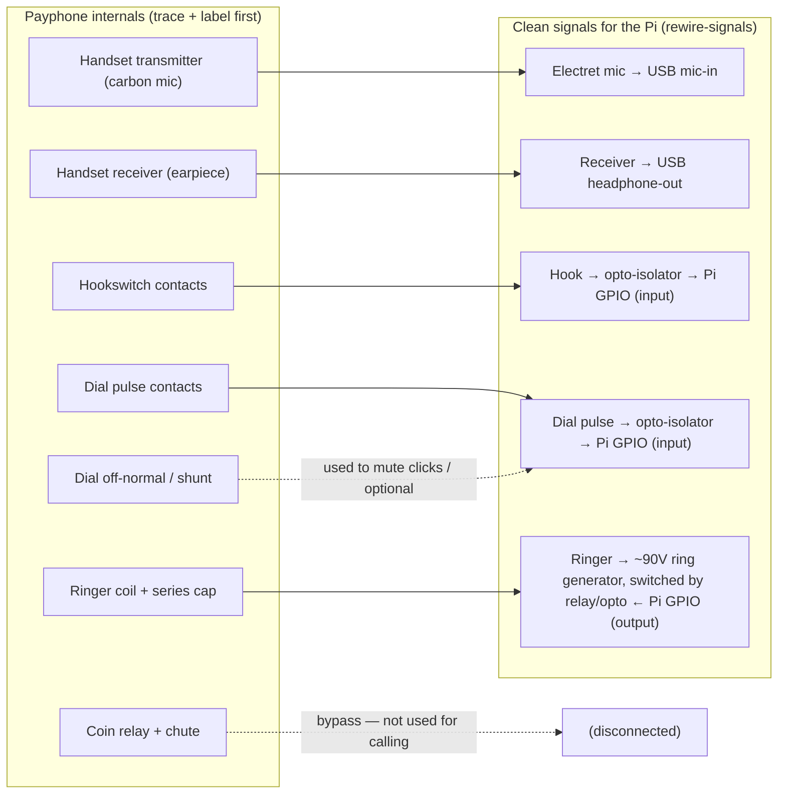
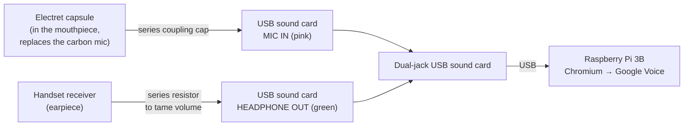

# Wiring Guide — Automatic Electric 3-slot payphone → Raspberry Pi (V2)

How to reverse-engineer the payphone's internals and break them out into clean signals for the Pi,
plus the handset-audio wiring. Companion to [PLAN.md](./PLAN.md), [HARDWARE.md](./HARDWARE.md), and
[PI-SETUP.md](./PI-SETUP.md). Covers tasks `reverse-wiring`, `rewire-signals`, and `v2-audio`.

> ⚠️ **Safety:** the bell **ring circuit runs at ~90V AC / 20Hz — shock hazard.** Do the audio,
> hook, and dial wiring in this guide first with the ring generator **unpowered**. Keep all Pi/GPIO
> logic **opto-isolated** from the line/ring voltage, and never power the Pi from any HV rail.

> ℹ️ **Wire colors vary** by model and vintage on Automatic Electric sets — treat the **multimeter
> as the source of truth**, not any fixed color code. Trace and label every wire yourself.

---

## Part 1 — Reverse-engineering the internals (`reverse-wiring`)

### What's inside an AE 3-slot
| Subsystem | What it is | How to identify it (multimeter) |
|-----------|-----------|----------------------------------|
| **Handset transmitter** | Carbon microphone in the mouthpiece | Low, *variable* resistance; reading jumps/scratches when you tap the capsule |
| **Handset receiver** | Magnetic earpiece | Steady resistance, typically a few hundred ohms |
| **Hookswitch** | Contacts under the cradle | Continuity **changes** when you lift/lower the hook |
| **Rotary dial — pulse** | Interrupter contacts | While dialing a digit, they **open/close N times** (N = digit) |
| **Rotary dial — off-normal/shunt** | "Busy while dialing" contacts | **Closed for the whole duration** the dial is turning |
| **Ringer** | Coil + series capacitor + two gongs | Coil = few hundred Ω–~2kΩ; a capacitor sits **in series** with it |
| **Network / induction coil** | Anti-sidetone hybrid | Multi-terminal coil block; not needed — we interface around it |
| **Coin relay + chute** | Coin validation / signaling | **Bypass** — not used for calling |
| **Tip / Ring** | The two line wires | The pair that would go to the phone jack (often red/green) |

### Tracing procedure
> 📝 **Record your measurements in [WIRING-WORKSHEET.md](./WIRING-WORKSHEET.md)** as you go — it has
> fill-in tables for every step below, and becomes the source of truth for all later wiring.
>
> 💡 A multimeter can't reliably follow a dial's 10 pulses/second. Once you've narrowed down the
> candidate pairs, use **`tools/gpio_probe.py`** to let the Pi read them (see
> [SOFTWARE.md](./SOFTWARE.md)) — it decodes digits live.

1. **Power off / disconnect everything.** Never probe with the ring generator connected/powered.
2. Set the multimeter to **continuity / ohms**.
3. **Handset:** at the handset-cord terminals, find the **transmitter pair** (variable resistance,
   reacts to tapping) and the **receiver pair** (steady few-hundred ohms). Label them.
4. **Hookswitch:** watch the meter while lifting/lowering the hook; note which contact pairs
   **open** and which **close** (off-hook vs on-hook). Pick a clean pair for on/off-hook sensing.
5. **Dial:** slowly dial a digit and watch the meter — the **pulse** contacts click open/closed
   that many times; the **off-normal** contacts stay closed the whole rotation. Label both pairs.
6. **Ringer:** identify the **coil** and its **series capacitor**; these get driven by the ~90V
   ring generator later (do **not** power it yet).
7. **Coin mechanism:** identify the coin relay/switch terminals so you can **isolate/bypass** them.
8. Draw and **label a wire map** before cutting or re-terminating anything.

### What we expose (map internals → Pi signals)

### Rewiring to clean signals (`rewire-signals`)
- Land the four live subsystems (handset, hook, dial, ringer) on a **terminal block** so each is a
  clean, serviceable connection.
- **Bypass the coin mechanism** — isolate its relay/switch so it doesn't gate the audio path.
  (Optional later: re-use the coin-drop switch as an "insert coin for dial tone" gate — task `coin-gate`.)
- Keep the ringer wiring physically separated from the low-voltage logic wiring.

---

## Part 2 — Handset audio wiring (`v2-audio`)

Goal: connect the handset's mic and earpiece to the **dual-jack USB sound card** (decision **D5** =
electret transmitter). The USB card supplies electret bias on its mic input, so wiring stays simple.

### Notes
- **Mic (transmitter):** drop an **electret capsule** into the mouthpiece; wire it to the USB card's
  **MIC IN** through a small **series coupling capacitor**. The USB card's plug-in-power bias drives
  the electret — no separate supply needed. (Keeping the original **carbon** mic is possible but
  needs its own DC bias network and sounds rougher — see D5.)
- **Earpiece (receiver):** the original receiver is higher-impedance than headphones, so drive it
  from the USB card's **HEADPHONE OUT** through a **series resistor** to bring the level down to a
  comfortable volume. Tune the resistor value by ear.
- Use the **3.5mm pigtails / screw-terminal breakout** so you can connect/disconnect without
  cutting the sound-card cables.
- Once wired, set the USB card as the default input/output in `pavucontrol` and select the mic in
  Chromium (`chrome://settings/content/microphone`) — same as the headset test in PI-SETUP Step 7–8.

---

## Related decisions
See the [decision log](./TASKS.md#decision-log): **D5** handset transmitter = electret + bias ·
**D6** dial reader = direct Pi GPIO (opto-isolated) · **D4** ring generator = off-the-shelf ~90V
module. Hook, dial, and bell wiring detail will be added here as those tasks are built.
